# Background Agent System Visualization

## 🏗️ System Architecture Overview

```mermaid
graph TB
    %% User/External Interface
    User[👤 User/External System]
    
    %% Background Agent Manager
    BAM[🎛️ BackgroundAgentManager]
    
    %% Agent Instances
    subgraph "Background Agents"
        BA1[🤖 File Monitor Agent]
        BA2[🤖 System Health Agent]
        BA3[🤖 Data Processor Agent]
        BA4[🤖 Custom Agent...]
    end
    
    %% Core Components
    subgraph "Core Infrastructure"
        TR[📋 TaskRegistry]
        SB[⏰ SchedulerBackend<br/>APScheduler]
        MR[🧠 MemoryRouter]
        ER[📡 EventRouter]
    end
    
    %% Storage Backends
    subgraph "Storage Layer"
        subgraph "Memory Stores"
            IM[💾 In-Memory]
            RD[🔴 Redis]
            DB[🗄️ Database]
            QD[🔍 Qdrant]
            CD[🌈 ChromaDB]
        end
        
        subgraph "Event Stores"
            IME[💾 In-Memory Events]
            RSE[🔴 Redis Stream Events]
        end
    end
    
    %% Tool Layer
    subgraph "Tool Layer"
        TR[🔧 ToolRegistry]
        MCP[🔌 MCP Tools]
        LT[🛠️ Local Tools]
    end
    
    %% External Services
    subgraph "External Services"
        LLM[🧠 LLM Provider<br/>OpenAI/Anthropic/etc]
        VDB[🗃️ Vector Database<br/>Qdrant/ChromaDB]
        MSG[💬 Message Queue<br/>Redis Streams]
    end
    
    %% Connections
    User --> BAM
    BAM --> BA1
    BAM --> BA2
    BAM --> BA3
    BAM --> BA4
    
    BA1 --> TR
    BA2 --> TR
    BA3 --> TR
    BA4 --> TR
    
    BA1 --> SB
    BA2 --> SB
    BA3 --> SB
    BA4 --> SB
    
    BA1 --> MR
    BA2 --> MR
    BA3 --> MR
    BA4 --> MR
    
    BA1 --> ER
    BA2 --> ER
    BA3 --> ER
    BA4 --> ER
    
    MR --> IM
    MR --> RD
    MR --> DB
    MR --> QD
    MR --> CD
    
    ER --> IME
    ER --> RSE
    
    TR --> MCP
    TR --> LT
    
    BA1 --> LLM
    BA2 --> LLM
    BA3 --> LLM
    BA4 --> LLM
    
    MR --> VDB
    ER --> MSG
    
    %% Styling
    classDef manager fill:#ff6b6b,stroke:#333,stroke-width:2px,color:#fff
    classDef agent fill:#4ecdc4,stroke:#333,stroke-width:2px,color:#fff
    classDef component fill:#45b7d1,stroke:#333,stroke-width:2px,color:#fff
    classDef storage fill:#96ceb4,stroke:#333,stroke-width:2px,color:#fff
    classDef tool fill:#feca57,stroke:#333,stroke-width:2px,color:#fff
    classDef external fill:#ff9ff3,stroke:#333,stroke-width:2px,color:#fff
    
    class BAM manager
    class BA1,BA2,BA3,BA4 agent
    class TR,SB,MR,ER component
    class IM,RD,DB,QD,CD,IME,RSE storage
    class TR,MCP,LT tool
    class LLM,VDB,MSG external
```



## 🔄 Background Agent Lifecycle


## 🎯 Agent Task Execution Flow

```mermaid
flowchart TD
    Start([Task Triggered]) --> CheckRunning{Agent Running?}
    
    CheckRunning -->|Yes| Skip[Skip Execution]
    CheckRunning -->|No| Init[Initialize Session]
    
    Init --> EmitStart[Emit BACKGROUND_TASK_STARTED]
    EmitStart --> EmitStatus[Emit BACKGROUND_AGENT_STATUS]
    
    EmitStatus --> LoadMemory[Load Context from Memory]
    LoadMemory --> Execute[Execute Task with LLM]
    
    Execute --> CheckResult{Task Success?}
    
    CheckResult -->|Yes| StoreResult[Store Results in Memory]
    CheckResult -->|No| CheckRetries{Retries < Max?}
    
    CheckRetries -->|Yes| Wait[Wait Retry Delay]
    Wait --> Execute
    
    CheckRetries -->|No| EmitError[Emit BACKGROUND_TASK_ERROR]
    StoreResult --> EmitComplete[Emit BACKGROUND_TASK_COMPLETED]
    
    EmitError --> UpdateMetrics[Update Error Count]
    EmitComplete --> UpdateMetrics
    
    UpdateMetrics --> EmitFinalStatus[Emit BACKGROUND_AGENT_STATUS]
    EmitFinalStatus --> End([Task Complete])
    Skip --> End
    
    %% Styling
    classDef start fill:#4ecdc4,stroke:#333,stroke-width:2px,color:#fff
    classDef process fill:#45b7d1,stroke:#333,stroke-width:2px,color:#fff
    classDef decision fill:#feca57,stroke:#333,stroke-width:2px,color:#fff
    classDef event fill:#ff6b6b,stroke:#333,stroke-width:2px,color:#fff
    classDef end fill:#96ceb4,stroke:#333,stroke-width:2px,color:#fff
    
    class Start,End start
    class Init,LoadMemory,Execute,StoreResult,UpdateMetrics process
    class CheckRunning,CheckResult,CheckRetries decision
    class EmitStart,EmitStatus,EmitError,EmitComplete,EmitFinalStatus event
```

## 🛠️ Tool Integration Architecture


## 📊 Event Streaming Architecture


## 🧠 Memory Management Architecture


## 🎛️ Management Interface


## 📈 Monitoring & Observability


## 🚀 Deployment Architecture


---

## 📋 Key Components Summary

| Component | Purpose | Key Features |
|-----------|---------|--------------|
| **BackgroundAgentManager** | Orchestrates all background agents | Agent lifecycle, scheduling, monitoring |
| **BackgroundOmniAgent** | Self-flying agent implementation | Task execution, retry logic, event emission |
| **TaskRegistry** | Manages task definitions | Task configuration, validation |
| **SchedulerBackend** | Handles scheduling | APScheduler integration, interval management |
| **MemoryRouter** | Memory management | Multi-backend support, context loading |
| **EventRouter** | Event management | Event streaming, store switching |
| **ToolRegistry** | Tool management | Local and MCP tool integration |

## 🎯 Use Cases

1. **File System Monitoring**: Automatically monitor and analyze file changes
2. **System Health Checks**: Continuous system performance monitoring
3. **Data Processing**: Automated data analysis and reporting
4. **Content Generation**: Scheduled content creation and updates
5. **Backup & Maintenance**: Automated system maintenance tasks
6. **Alerting & Notifications**: Proactive monitoring and alerting
7. **API Monitoring**: Continuous API health and performance checks
8. **Database Maintenance**: Automated database optimization and cleanup

This visualization shows a complete, production-ready background agent system that can scale from simple automation to complex, multi-agent orchestration! 🚀 