# Architecture

MCPOmni Connect is built with a modular, extensible architecture designed for scalability, reliability, and ease of use. This document provides a comprehensive overview of the system's design and components.

## System Overview

MCPOmni Connect acts as an intelligent gateway between users and the Model Context Protocol (MCP) ecosystem, providing AI-powered automation and orchestration capabilities.


## Core Components

### 1. CLI Interface Layer

The user-facing command-line interface that handles input/output and user interactions.

**Responsibilities:**
- Command parsing and validation
- User input handling
- Output formatting and display
- Interactive prompts and confirmations
- Error message presentation

**Key Features:**
- Rich text formatting with syntax highlighting
- Interactive command completion
- Real-time status updates
- Debug mode visualization

### 2. Core Engine

The central orchestrator that coordinates all system components.

**Responsibilities:**
- Component lifecycle management
- Event coordination and messaging
- Configuration management
- Error handling and recovery
- System state management

**Components:**
```python
class CoreEngine:
    def __init__(self):
        self.session_manager = SessionManager()
        self.transport_layer = TransportLayer()
        self.llm_integration = LLMIntegration()
        self.memory_manager = MemoryManager()
        self.agent_system = AgentSystem()
```

### 3. Agent System

The AI-powered decision-making and execution engine.

```mermaid
graph LR
    Agent[🧠 Agent System] --> ReAct[🔄 ReAct Engine]
    Agent --> Orchestrator[🎯 Orchestrator]
    Agent --> Context[📚 Context Manager]
    
    ReAct --> Reasoning[💭 Reasoning]
    ReAct --> Acting[⚡ Acting]
    ReAct --> Observing[👁️ Observing]
    
    Orchestrator --> Planning[📋 Planning]
    Orchestrator --> Coordination[🤝 Coordination]
    Orchestrator --> Monitoring[📊 Monitoring]
```

**Mode Architecture:**

=== "Chat Mode"
    ```python
    class ChatMode:
        def process_request(self, user_input):
            # 1. Parse user intent
            intent = self.parse_intent(user_input)
            
            # 2. Plan actions
            actions = self.plan_actions(intent)
            
            # 3. Request approval for each action
            for action in actions:
                if self.request_approval(action):
                    result = self.execute_action(action)
                    self.present_result(result)
    ```

=== "Autonomous Mode"
    ```python
    class AutonomousMode:
        def process_request(self, user_input):
            # 1. Parse and understand goal
            goal = self.parse_goal(user_input)
            
            # 2. ReAct loop
            while not self.goal_achieved(goal):
                thought = self.think(current_state)
                action = self.plan_action(thought)
                observation = self.execute_action(action)
                self.update_state(observation)
            
            # 3. Report completion
            return self.generate_report()
    ```

=== "Orchestrator Mode"
    ```python
    class OrchestratorMode:
        def process_request(self, user_input):
            # 1. Strategic analysis
            strategy = self.analyze_requirements(user_input)
            
            # 2. Multi-phase planning
            phases = self.create_execution_plan(strategy)
            
            # 3. Coordinate execution
            for phase in phases:
                agents = self.allocate_agents(phase)
                results = self.execute_parallel(agents)
                self.merge_results(results)
            
            return self.final_report()
    ```

## Transport Layer

### Transport Architecture

```mermaid
graph TB
    TL[🚀 Transport Layer] --> TM[📋 Transport Manager]
    TM --> Registry[📊 Transport Registry]
    TM --> Factory[🏭 Transport Factory]
    
    Factory --> StdioT[📺 Stdio Transport]
    Factory --> SSET[📡 SSE Transport]
    Factory --> HTTPT[🌐 HTTP Transport]
    
    StdioT --> Process[⚙️ Process Manager]
    SSET --> EventStream[📈 Event Stream]
    HTTPT --> AuthManager[🔐 Auth Manager]
    
    AuthManager --> OAuth[🔑 OAuth Handler]
    AuthManager --> Bearer[🎫 Bearer Token]
    AuthManager --> Custom[🔧 Custom Headers]
```

### Transport Implementations

#### Stdio Transport
```python
class StdioTransport:
    def __init__(self, command, args):
        self.process = subprocess.Popen(
            [command] + args,
            stdin=subprocess.PIPE,
            stdout=subprocess.PIPE,
            stderr=subprocess.PIPE
        )
    
    async def send_message(self, message):
        await self.process.stdin.write(message)
    
    async def receive_message(self):
        return await self.process.stdout.readline()
```

#### SSE Transport
```python
class SSETransport:
    def __init__(self, url, headers):
        self.url = url
        self.headers = headers
        self.client = httpx.AsyncClient()
    
    async def connect(self):
        self.stream = self.client.stream(
            "GET", self.url, headers=self.headers
        )
    
    async def receive_events(self):
        async for line in self.stream.aiter_lines():
            if line.startswith("data: "):
                yield json.loads(line[6:])
```

#### HTTP Transport
```python
class HTTPTransport:
    def __init__(self, url, auth_config):
        self.url = url
        self.auth = self.setup_auth(auth_config)
        self.client = httpx.AsyncClient()
    
    async def send_request(self, data):
        response = await self.client.post(
            self.url,
            json=data,
            headers=self.auth.get_headers()
        )
        return response.json()
```

## Session Management

### Session Architecture

```mermaid
graph LR
    SM[🔄 Session Manager] --> SL[📊 Session Lifecycle]
    SM --> CR[🔗 Connection Registry]
    SM --> HM[💖 Health Monitor]
    
    CR --> Servers[🖥️ Server Connections]
    HM --> Heartbeat[💓 Heartbeat]
    HM --> Recovery[🔄 Recovery]
    
    Servers --> Active[✅ Active]
    Servers --> Idle[😴 Idle]
    Servers --> Failed[❌ Failed]
```

### Connection Management

```python
class SessionManager:
    def __init__(self):
        self.connections = {}
        self.health_monitor = HealthMonitor()
        self.recovery_manager = RecoveryManager()
    
    async def connect_server(self, server_config):
        transport = self.create_transport(server_config)
        connection = await transport.connect()
        
        self.connections[server_config.name] = connection
        self.health_monitor.add_connection(connection)
        
        return connection
    
    async def health_check(self):
        for name, connection in self.connections.items():
            if not await connection.is_healthy():
                await self.recovery_manager.recover(name, connection)
```

## LLM Integration

### LiteLLM Integration Architecture

```mermaid
graph TB
    LLM[🤖 LLM Integration] --> LiteLLM[⚡ LiteLLM]
    LLM --> Config[⚙️ Config Manager]
    LLM --> Context[📚 Context Manager]
    
    LiteLLM --> OpenAI[🔵 OpenAI]
    LiteLLM --> Anthropic[🟣 Anthropic]
    LiteLLM --> Google[🔴 Google]
    LiteLLM --> Others[... Others]
    
    Context --> Window[🪟 Context Window]
    Context --> History[📜 History]
    Context --> Pruning[✂️ Pruning]
```

### LLM Integration Implementation

```python
class LLMIntegration:
    def __init__(self, config):
        self.config = config
        self.context_manager = ContextManager()
        self.client = self.setup_litellm()
    
    def setup_litellm(self):
        return litellm.completion
    
    async def generate_response(self, messages, tools=None):
        # Prepare context
        context = self.context_manager.prepare_context(messages)
        
        # Call LLM
        response = await self.client(
            model=f"{self.config.provider}/{self.config.model}",
            messages=context,
            tools=tools,
            temperature=self.config.temperature,
            max_tokens=self.config.max_tokens
        )
        
        return response
```

## Memory Management

### Memory Architecture

```mermaid
graph TB
    MM[💾 Memory System] --> IM[🧠 InMemoryStore]
    MM --> RM[📊 RedisShortTermMemory]
    MM --> File[📁 File Storage]
    
    IM --> Session[⚡ Session Storage]
    IM --> Context[📦 Context Management]
    IM --> Truncation[✂️ Token Truncation]
    
    RM --> Persistence[💾 Redis Persistence]
    RM --> TTL[⏰ TTL Management]
    RM --> Serialization[🔄 Serialization]
    
    File --> Save[💾 Save Operations]
    File --> Load[📥 Load Operations]
    File --> Backup[🔄 Backup]
```

### Memory Implementation

```python
# InMemoryStore - Database compatible session memory
class InMemoryStore:
    def __init__(self, max_context_tokens=30000, debug=False):
        self.sessions_history = {}  # session_id -> messages
        self.max_context_tokens = max_context_tokens
        self.debug = debug
    
    async def store_message(self, role, content, metadata=None, session_id=None):
        # Store message with agent_name in metadata
        if metadata is None:
            metadata = {}
        
        message = {
            "role": role,
            "content": content,
            "session_id": session_id,
            "timestamp": time.time(),
            "metadata": metadata,
        }
        
        if session_id not in self.sessions_history:
            self.sessions_history[session_id] = []
        self.sessions_history[session_id].append(message)
    
    async def get_messages(self, session_id=None, agent_name=None):
        # Get messages for session, optionally filtered by agent
        if session_id not in self.sessions_history:
            return []
        
        messages = self.sessions_history[session_id]
        
        # Filter by agent_name if provided
        if agent_name:
            messages = [
                msg for msg in messages 
                if msg.get("metadata", {}).get("agent_name") == agent_name
            ]
        
        return messages

# RedisShortTermMemory - Persistent memory with Redis
class RedisShortTermMemory:
    def __init__(self, redis_client=None, max_context_tokens=30000):
        self._redis_client = redis_client or redis.Redis()
        self.max_context_tokens = max_context_tokens
    
    async def store_message(self, role, content, metadata=None):
        # Store in Redis with client ID
        key = f"mcp_memory:{self.client_id}"
        message = {
            "role": role,
            "content": content,
            "metadata": metadata,
            "timestamp": time.time(),
        }
        await self._redis_client.zadd(key, {json.dumps(message): time.time()})
    
    async def get_messages(self):
        # Retrieve from Redis
        key = f"mcp_memory:{self.client_id}"
        messages = await self._redis_client.zrange(key, 0, -1)
        return [json.loads(msg) for msg in messages]
```

## Tool Management

### Tool Discovery and Execution

```mermaid
graph LR
    TM[🔧 Tool Manager] --> Discovery[🔍 Discovery]
    TM --> Registry[📋 Registry]
    TM --> Executor[⚡ Executor]
    
    Discovery --> Servers[🖥️ Server Tools]
    Registry --> Metadata[📊 Tool Metadata]
    Registry --> Routing[🛤️ Routing Rules]
    
    Executor --> Parallel[⚡ Parallel Exec]
    Executor --> Serial[🔄 Serial Exec]
    Executor --> Fallback[🔄 Fallback]
```

### Tool Execution Engine

```python
class ToolManager:
    def __init__(self):
        self.registry = ToolRegistry()
        self.executor = ToolExecutor()
        self.router = ToolRouter()
    
    async def discover_tools(self, connections):
        for connection in connections:
            tools = await connection.list_tools()
            for tool in tools:
                self.registry.register(tool, connection)
    
    async def execute_tool(self, tool_name, parameters):
        # Route to appropriate server
        connection = self.router.route(tool_name)
        
        # Execute with timeout and retry
        return await self.executor.execute(
            connection, tool_name, parameters
        )
```

## Security Architecture

### Security Layers

```mermaid
graph TB
    Security[🔐 Security] --> Auth[🔑 Authentication]
    Security --> Authz[🛡️ Authorization]
    Security --> Encryption[🔒 Encryption]
    Security --> Isolation[🏰 Isolation]
    
    Auth --> OAuth[🔐 OAuth 2.0]
    Auth --> Tokens[🎫 Bearer Tokens]
    Auth --> Custom[🔧 Custom Auth]
    
    Authz --> ServerLevel[🖥️ Server Level]
    Authz --> ToolLevel[🔧 Tool Level]
    
    Encryption --> Transit[🚀 In Transit]
    Encryption --> Rest[💾 At Rest]
    
    Isolation --> ServerIso[🏠 Server Isolation]
    Isolation --> DataIso[📊 Data Isolation]
```

### Security Implementation

```python
class SecurityManager:
    def __init__(self):
        self.auth_manager = AuthenticationManager()
        self.authz_manager = AuthorizationManager()
        self.crypto = CryptographyManager()
    
    async def authenticate_server(self, server_config):
        if server_config.auth_method == "oauth":
            return await self.auth_manager.oauth_flow(server_config)
        elif server_config.auth_method == "bearer":
            return self.auth_manager.bearer_token(server_config)
        
    def encrypt_sensitive_data(self, data):
        return self.crypto.encrypt(data)
    
    def authorize_tool_access(self, tool, user_context):
        return self.authz_manager.check_permission(tool, user_context)
```

## Performance and Scalability

### Performance Architecture

```mermaid
graph LR
    Perf[⚡ Performance] --> Caching[🗄️ Caching]
    Perf --> Pooling[🏊 Connection Pooling]
    Perf --> Async[🔄 Async Processing]
    Perf --> Monitoring[📊 Monitoring]
    
    Caching --> ToolCache[🔧 Tool Results]
    Caching --> ContextCache[📚 Context Cache]
    
    Pooling --> ConnPool[🔗 Connection Pool]
    Pooling --> ThreadPool[🧵 Thread Pool]
    
    Async --> EventLoop[🔄 Event Loop]
    Async --> Coroutines[⚡ Coroutines]
```

### Performance Optimizations

```python
class PerformanceManager:
    def __init__(self):
        self.cache = CacheManager()
        self.connection_pool = ConnectionPool()
        self.metrics = MetricsCollector()
    
    async def execute_with_cache(self, tool_call):
        cache_key = self.generate_cache_key(tool_call)
        
        # Check cache first
        cached_result = await self.cache.get(cache_key)
        if cached_result:
            self.metrics.record_cache_hit(tool_call)
            return cached_result
        
        # Execute and cache result
        result = await self.execute_tool(tool_call)
        await self.cache.set(cache_key, result, ttl=300)
        
        self.metrics.record_cache_miss(tool_call)
        return result
```

## Configuration System

### Configuration Architecture

```mermaid
graph TB
    Config[⚙️ Configuration] --> Env[🌍 Environment]
    Config --> JSON[📄 JSON Config]
    Config --> Runtime[⚡ Runtime Config]
    
    Env --> APIKeys[🔑 API Keys]
    Env --> Redis[📊 Redis Config]
    Env --> Debug[🐛 Debug Settings]
    
    JSON --> LLMConfig[🤖 LLM Config]
    JSON --> Servers[🖥️ Server Config]
    JSON --> AgentConfig[🤖 Agent Config]
    
    Runtime --> Dynamic[🔄 Dynamic Updates]
    Runtime --> Validation[✅ Validation]
```

### Configuration Management

```python
class ConfigurationManager:
    def __init__(self):
        self.env_config = self.load_env_config()
        self.json_config = self.load_json_config()
        self.runtime_config = {}
        self.validators = ConfigValidators()
    
    def load_env_config(self):
        return {
            'llm_api_key': os.getenv('LLM_API_KEY'),
            'redis_host': os.getenv('REDIS_HOST', 'localhost'),
            'redis_port': int(os.getenv('REDIS_PORT', 6379)),
            'debug': os.getenv('DEBUG', 'false').lower() == 'true'
        }
    
    def validate_configuration(self):
        errors = []
        
        # Validate environment variables
        if not self.env_config.get('llm_api_key'):
            errors.append("LLM_API_KEY is required")
        
        # Validate JSON configuration
        if not self.json_config.get('LLM'):
            errors.append("LLM configuration is required")
        
        if errors:
            raise ConfigurationError(errors)
```

## Error Handling and Recovery

### Error Handling Strategy

```mermaid
graph TB
    Error[❌ Error Handling] --> Detection[🔍 Detection]
    Error --> Classification[📊 Classification]
    Error --> Recovery[🔄 Recovery]
    Error --> Reporting[📢 Reporting]
    
    Detection --> Monitoring[📊 Monitoring]
    Detection --> Logging[📝 Logging]
    
    Classification --> Transient[⏱️ Transient]
    Classification --> Permanent[🔒 Permanent]
    Classification --> Unknown[❓ Unknown]
    
    Recovery --> Retry[🔄 Retry]
    Recovery --> Fallback[🔄 Fallback]
    Recovery --> Graceful[✅ Graceful Degradation]
```

### Recovery Implementation

```python
class ErrorRecoveryManager:
    def __init__(self):
        self.retry_policies = RetryPolicies()
        self.fallback_strategies = FallbackStrategies()
        self.circuit_breakers = CircuitBreakerRegistry()
    
    async def handle_error(self, error, context):
        error_type = self.classify_error(error)
        
        if error_type == ErrorType.TRANSIENT:
            return await self.retry_with_backoff(context)
        elif error_type == ErrorType.PERMANENT:
            return await self.execute_fallback(context)
        else:
            return await self.graceful_degradation(context)
    
    async def retry_with_backoff(self, context, max_retries=3):
        for attempt in range(max_retries):
            try:
                await asyncio.sleep(2 ** attempt)  # Exponential backoff
                return await context.retry()
            except Exception as e:
                if attempt == max_retries - 1:
                    raise e
                continue
```

## Monitoring and Observability

### Observability Stack

```mermaid
graph LR
    Obs[👁️ Observability] --> Metrics[📊 Metrics]
    Obs --> Logging[📝 Logging]
    Obs --> Tracing[🔍 Tracing]
    Obs --> Health[💖 Health Checks]
    
    Metrics --> Performance[⚡ Performance]
    Metrics --> Usage[📈 Usage]
    Metrics --> Errors[❌ Errors]
    
    Logging --> Structured[📋 Structured]
    Logging --> Levels[📊 Log Levels]
    
    Tracing --> Requests[📍 Request Tracing]
    Tracing --> Dependencies[🔗 Dependency Tracing]
```

### Monitoring Implementation

```python
class MonitoringManager:
    def __init__(self):
        self.metrics_collector = MetricsCollector()
        self.logger = StructuredLogger()
        self.tracer = DistributedTracer()
        self.health_checker = HealthChecker()
    
    def record_tool_execution(self, tool_name, duration, success):
        self.metrics_collector.increment(
            'tool_executions_total',
            tags={'tool': tool_name, 'success': success}
        )
        self.metrics_collector.histogram(
            'tool_execution_duration',
            duration,
            tags={'tool': tool_name}
        )
    
    def log_user_interaction(self, user_input, response, context):
        self.logger.info(
            "user_interaction",
            user_input=user_input,
            response_length=len(response),
            mode=context.mode,
            servers_connected=len(context.servers)
        )
```

## Extensibility and Plugin System

### Plugin Architecture


This architecture provides a solid foundation for MCPOmni Connect's current capabilities while allowing for future expansion and customization.

---

**Next**: [API Reference →](api-reference.md) 