# Background Agent System

## 🚀 Overview

The Background Agent System provides a complete framework for creating self-flying, autonomous agents that can execute tasks automatically at specified intervals. Built on top of the OmniAgent framework, it offers enterprise-grade features including event streaming, memory management, tool orchestration, and comprehensive monitoring.

## 🏗️ Architecture

### System Components

```mermaid
graph TB
    %% User/External Interface
    User[👤 User/External System]
    
    %% Background Agent Manager
    BAM[🎛️ BackgroundAgentManager]
    
    %% Agent Instances
    subgraph "Background Agents"
        BA1[🤖 File Monitor Agent]
        BA2[🤖 System Health Agent]
        BA3[🤖 Data Processor Agent]
        BA4[🤖 Custom Agent...]
    end
    
    %% Core Components
    subgraph "Core Infrastructure"
        TR[📋 TaskRegistry]
        SB[⏰ SchedulerBackend<br/>APScheduler]
        MR[🧠 MemoryRouter]
        ER[📡 EventRouter]
    end
    
    %% Storage Backends
    subgraph "Storage Layer"
        subgraph "Memory Stores"
            IM[💾 In-Memory]
            RD[🔴 Redis]
            DB[🗄️ Database]
            QD[🔍 Qdrant]
            CD[🌈 ChromaDB]
        end
        
        subgraph "Event Stores"
            IME[💾 In-Memory Events]
            RSE[🔴 Redis Stream Events]
        end
    end
    
    %% Tool Layer
    subgraph "Tool Layer"
        TR[🔧 ToolRegistry]
        MCP[🔌 MCP Tools]
        LT[🛠️ Local Tools]
    end
    
    %% External Services
    subgraph "External Services"
        LLM[🧠 LLM Provider<br/>OpenAI/Anthropic/etc]
        VDB[🗃️ Vector Database<br/>Qdrant/ChromaDB]
        MSG[💬 Message Queue<br/>Redis Streams]
    end
    
    %% Connections
    User --> BAM
    BAM --> BA1
    BAM --> BA2
    BAM --> BA3
    BAM --> BA4
    
    BA1 --> TR
    BA2 --> TR
    BA3 --> TR
    BA4 --> TR
    
    BA1 --> SB
    BA2 --> SB
    BA3 --> SB
    BA4 --> SB
    
    BA1 --> MR
    BA2 --> MR
    BA3 --> MR
    BA4 --> MR
    
    BA1 --> ER
    BA2 --> ER
    BA3 --> ER
    BA4 --> ER
    
    MR --> IM
    MR --> RD
    MR --> DB
    MR --> QD
    MR --> CD
    
    ER --> IME
    ER --> RSE
    
    TR --> MCP
    TR --> LT
    
    BA1 --> LLM
    BA2 --> LLM
    BA3 --> LLM
    BA4 --> LLM
    
    MR --> VDB
    ER --> MSG
```



### Agent Lifecycle


## 🎯 Key Features

### ✅ **Self-Flying Automation**
- Agents execute tasks automatically at specified intervals
- No manual intervention required once configured
- Built-in retry logic with configurable attempts and delays

### ✅ **Event-Driven Architecture**
- Real-time event streaming for monitoring and debugging
- Support for multiple event backends (In-Memory, Redis Streams)
- Comprehensive event types for task lifecycle tracking

### ✅ **Memory Management**
- Persistent memory across task executions
- Support for multiple memory backends (In-Memory, Redis, Database, Qdrant, ChromaDB)
- Context loading and result storage

### ✅ **Tool Integration**
- Seamless integration with local tools via ToolRegistry
- MCP (Model Context Protocol) tool support
- Dynamic tool loading and execution

### ✅ **Monitoring & Observability**
- Real-time status monitoring
- Comprehensive metrics collection
- Event streaming for external monitoring systems

## 🛠️ Components

### BackgroundAgentManager

The central orchestrator that manages all background agents.

```python
from mcpomni_connect.omni_agent.background_agent import BackgroundAgentManager
from mcpomni_connect.memory_store.memory_router import MemoryRouter
from mcpomni_connect.events.event_router import EventRouter

# Initialize with shared components
memory_store = MemoryRouter(memory_store_type="redis")
event_router = EventRouter(event_store_type="redis_stream")

manager = BackgroundAgentManager(
    memory_store=memory_store,
    event_router=event_router
)
```

**Key Methods:**
- `create_agent(config)`: Create a new background agent
- `start()`: Start the manager and all agents
- `shutdown()`: Gracefully shutdown all agents
- `get_agent_status(agent_id)`: Get detailed status of an agent
- `pause_agent(agent_id)`: Pause agent execution
- `resume_agent(agent_id)`: Resume agent execution
- `update_agent_config(agent_id, config)`: Update agent configuration

### BackgroundOmniAgent

Extends OmniAgent with background execution capabilities.

```python
from mcpomni_connect.omni_agent.background_agent import BackgroundOmniAgent

agent = BackgroundOmniAgent(
    config={
        "agent_id": "file_monitor",
        "system_instruction": "Monitor file system for changes",
        "model_config": {"provider": "openai", "model": "gpt-4"},
        "task_config": {"query": "Check for new files and analyze them"},
        "interval": 300,  # 5 minutes
        "max_retries": 3,
        "retry_delay": 60
    },
    memory_store=memory_store,
    event_router=event_router
)
```

**Key Features:**
- Automatic task execution at specified intervals
- Built-in retry logic with exponential backoff
- Event emission for task lifecycle tracking
- Memory persistence across executions
- Tool integration (local and MCP)

### TaskRegistry

Manages task definitions and configurations.

```python
from mcpomni_connect.omni_agent.background_agent import TaskRegistry

registry = TaskRegistry()

# Register a task
registry.register_task(
    task_id="file_monitoring",
    description="Monitor file system for changes",
    config={
        "directories": ["/tmp", "/home/user/documents"],
        "file_types": [".txt", ".log", ".csv"]
    }
)
```

### SchedulerBackend

Handles task scheduling using APScheduler.

```python
from mcpomni_connect.omni_agent.background_agent import APSchedulerBackend

scheduler = APSchedulerBackend()

# Schedule a task
scheduler.schedule_task(
    task_id="file_monitor",
    func=agent.run_task,
    interval=300,  # 5 minutes
    max_instances=1
)
```

## 📊 Event System

### Event Types

The background agent system emits several types of events:

```python
from mcpomni_connect.events.base import EventType

# Task lifecycle events
BACKGROUND_TASK_STARTED = "background_task_started"
BACKGROUND_TASK_COMPLETED = "background_task_completed"
BACKGROUND_TASK_ERROR = "background_task_error"

# Agent status events
BACKGROUND_AGENT_STATUS = "background_agent_status"
```

### Event Payloads

Each event includes detailed payload information:

```python
from mcpomni_connect.events.base import (
    BackgroundTaskStartedPayload,
    BackgroundTaskCompletedPayload,
    BackgroundTaskErrorPayload,
    BackgroundAgentStatusPayload
)

# Task started payload
BackgroundTaskStartedPayload(
    agent_id="file_monitor",
    session_id="background_file_monitor_1234567890",
    timestamp="2024-01-15T10:30:00",
    run_count=5,
    kwargs={"query": "Check for new files"}
)

# Agent status payload
BackgroundAgentStatusPayload(
    agent_id="file_monitor",
    status="running",  # or "idle", "error"
    timestamp="2024-01-15T10:30:00",
    session_id="background_file_monitor_1234567890",
    last_run="2024-01-15T10:25:00",
    run_count=5,
    error_count=0,
    error=None
)
```

### Event Consumption

```python
import asyncio
from mcpomni_connect.events.event_router import EventRouter

async def consume_events(event_router: EventRouter, session_id: str):
    """Consume events from a background agent."""
    async for event in event_router.stream(session_id=session_id):
        print(f"Event: {event.type}")
        print(f"Agent: {event.agent_name}")
        print(f"Payload: {event.payload}")
        print("-" * 40)

# Usage
event_router = EventRouter(event_store_type="redis_stream")
await consume_events(event_router, "background_file_monitor_1234567890")
```

## 🧠 Memory Management

### Memory Types

Background agents use multiple types of memory:

1. **Working Memory**: Current session context
2. **Episodic Memory**: Conversation and task history
3. **Long-term Memory**: Persistent knowledge base
4. **Procedural Memory**: Task execution patterns

### Memory Backends

```python
from mcpomni_connect.memory_store.memory_router import MemoryRouter

# In-Memory (default)
memory_store = MemoryRouter(memory_store_type="memory")

# Redis
memory_store = MemoryRouter(memory_store_type="redis")

# Database
memory_store = MemoryRouter(memory_store_type="database")

# Vector Database (Qdrant)
memory_store = MemoryRouter(memory_store_type="qdrant")

# ChromaDB (local fallback)
memory_store = MemoryRouter(memory_store_type="chromadb")
```

### Memory Operations

```python
# Store information
await memory_store.store_message(
    session_id="background_file_monitor_1234567890",
    role="assistant",
    content="Found 3 new files in /tmp directory",
    memory_type="episodic"
)

# Retrieve context
context = await memory_store.get_context(
    session_id="background_file_monitor_1234567890",
    memory_type="episodic",
    limit=10
)

# Semantic search
results = await memory_store.query_both_memory_types(
    query="file monitoring results",
    limit=5
)
```

## 🔧 Tool Integration

### Local Tools

```python
from mcpomni_connect.agents.tools.local_tools_registry import ToolRegistry

# Create tool registry
local_tools = ToolRegistry()

# Register tools using decorators
@local_tools.register_tool(
    name="calculate_area",
    description="Calculate the area of a rectangle",
    inputSchema={
        "type": "object",
        "properties": {
            "length": {"type": "number"},
            "width": {"type": "number"}
        },
        "required": ["length", "width"]
    }
)
def calculate_area(length: float, width: float) -> float:
    return length * width

@local_tools.register_tool(
    name="get_system_info",
    description="Get system information"
)
def get_system_info() -> str:
    return "System: Linux, CPU: 8 cores, Memory: 16GB"
```

### MCP Tools

```python
# MCP tool configuration
mcp_tools = [
    {
        "name": "filesystem",
        "transport_type": "stdio",
        "command": "npx",
        "args": ["-y", "@modelcontextprotocol/server-filesystem", "/tmp"]
    },
    {
        "name": "database",
        "transport_type": "stdio", 
        "command": "npx",
        "args": ["-y", "@modelcontextprotocol/server-database"]
    }
]
```

## 📈 Monitoring & Status

### Agent Status

```python
# Get comprehensive agent status
status = manager.get_agent_status("file_monitor")

print(f"Agent ID: {status['agent_id']}")
print(f"Running: {status['is_running']}")
print(f"Run Count: {status['run_count']}")
print(f"Error Count: {status['error_count']}")
print(f"Last Run: {status['last_run']}")
print(f"Available Tools: {status['available_tools']}")
print(f"Event Store: {status['event_store']}")
print(f"Memory Store: {status['memory_store']}")
```

### Manager Status

```python
# Get overall manager status
manager_status = manager.get_manager_status()

print(f"Total Agents: {manager_status['total_agents']}")
print(f"Running Agents: {manager_status['running_agents']}")
print(f"Paused Agents: {manager_status['paused_agents']}")
print(f"Agent List: {manager_status['agents']}")
```

### Event Monitoring

```python
# Real-time event monitoring
async def monitor_events():
    async for event in event_router.stream(session_id="background_file_monitor_1234567890"):
        if event.type == EventType.BACKGROUND_TASK_ERROR:
            # Send alert
            send_alert(f"Agent {event.agent_name} encountered error: {event.payload.error}")
        elif event.type == EventType.BACKGROUND_TASK_COMPLETED:
            # Log success
            log_success(f"Agent {event.agent_name} completed task successfully")
```

## 🚀 Use Cases

### 1. File System Monitoring

```python
file_monitor_config = {
    "agent_id": "file_monitor",
    "system_instruction": "Monitor file system for new files and analyze their contents",
    "model_config": {"provider": "openai", "model": "gpt-4"},
    "task_config": {
        "query": "Check for new files in /tmp and /home/user/documents",
        "directories": ["/tmp", "/home/user/documents"],
        "file_types": [".txt", ".log", ".csv"]
    },
    "interval": 300,  # 5 minutes
    "max_retries": 3
}
```

### 2. System Health Monitoring

```python
system_health_config = {
    "agent_id": "system_health",
    "system_instruction": "Monitor system resources and performance",
    "model_config": {"provider": "openai", "model": "gpt-4"},
    "task_config": {
        "query": "Check CPU, memory, and disk usage",
        "thresholds": {
            "cpu_usage": 80,
            "memory_usage": 85,
            "disk_usage": 90
        }
    },
    "interval": 600,  # 10 minutes
    "max_retries": 2
}
```

### 3. Data Processing

```python
data_processor_config = {
    "agent_id": "data_processor",
    "system_instruction": "Process and analyze data files automatically",
    "model_config": {"provider": "openai", "model": "gpt-4"},
    "task_config": {
        "query": "Process data files and generate reports",
        "data_sources": ["/home/user/data"],
        "output_format": "json"
    },
    "interval": 1800,  # 30 minutes
    "max_retries": 1
}
```

### 4. Content Generation

```python
content_generator_config = {
    "agent_id": "content_generator",
    "system_instruction": "Generate content based on current trends and data",
    "model_config": {"provider": "openai", "model": "gpt-4"},
    "task_config": {
        "query": "Generate weekly content summary",
        "content_types": ["blog_posts", "social_media", "newsletters"],
        "topics": ["technology", "ai", "automation"]
    },
    "interval": 604800,  # 1 week
    "max_retries": 2
}
```

## 🔧 Configuration

### Environment Variables

```bash
# Memory Configuration
MEMORY_STORE_TYPE=redis  # memory, redis, database, qdrant, chromadb
REDIS_HOST=localhost
REDIS_PORT=6379
REDIS_DB=0

# Event Configuration
EVENT_STORE_TYPE=redis_stream  # memory, redis_stream
REDIS_STREAM_KEY=background_agent_events

# Vector Database Configuration
QDRANT_HOST=localhost
QDRANT_PORT=6333
CHROMADB_PERSIST_DIRECTORY=./chromadb_data

# LLM Configuration
OPENAI_API_KEY=your-api-key-here
ANTHROPIC_API_KEY=your-api-key-here
```

### Configuration File

```python
# config.yaml
background_agents:
  file_monitor:
    agent_id: "file_monitor"
    system_instruction: "Monitor file system for changes"
    model_config:
      provider: "openai"
      model: "gpt-4"
    task_config:
      query: "Check for new files and analyze them"
      directories: ["/tmp", "/home/user/documents"]
    interval: 300
    max_retries: 3
    retry_delay: 60
    
  system_health:
    agent_id: "system_health"
    system_instruction: "Monitor system resources"
    model_config:
      provider: "openai"
      model: "gpt-4"
    task_config:
      query: "Check system health and performance"
    interval: 600
    max_retries: 2
```

## 🚀 Deployment

### Docker Deployment

```dockerfile
FROM python:3.11-slim

WORKDIR /app

COPY requirements.txt .
RUN pip install -r requirements.txt

COPY . .

CMD ["python", "-m", "mcpomni_connect.omni_agent.background_agent"]
```

### Docker Compose

```yaml
version: '3.8'

services:
  background-agents:
    build: .
    environment:
      - MEMORY_STORE_TYPE=redis
      - EVENT_STORE_TYPE=redis_stream
      - REDIS_HOST=redis
      - QDRANT_HOST=qdrant
    depends_on:
      - redis
      - qdrant
    volumes:
      - ./config:/app/config
      - ./data:/app/data

  redis:
    image: redis:7-alpine
    ports:
      - "6379:6379"

  qdrant:
    image: qdrant/qdrant:latest
    ports:
      - "6333:6333"
    volumes:
      - qdrant_data:/qdrant/storage

volumes:
  qdrant_data:
```

### Kubernetes Deployment

```yaml
apiVersion: apps/v1
kind: Deployment
metadata:
  name: background-agents
spec:
  replicas: 3
  selector:
    matchLabels:
      app: background-agents
  template:
    metadata:
      labels:
        app: background-agents
    spec:
      containers:
      - name: background-agents
        image: background-agents:latest
        env:
        - name: MEMORY_STORE_TYPE
          value: "redis"
        - name: EVENT_STORE_TYPE
          value: "redis_stream"
        - name: REDIS_HOST
          value: "redis-service"
        - name: QDRANT_HOST
          value: "qdrant-service"
        resources:
          requests:
            memory: "512Mi"
            cpu: "250m"
          limits:
            memory: "1Gi"
            cpu: "500m"
```

## 🔍 Troubleshooting

### Common Issues

1. **Agent Not Starting**
   - Check configuration syntax
   - Verify API keys are set
   - Check memory and event store connectivity

2. **Tasks Not Executing**
   - Verify scheduler is running
   - Check agent status
   - Review event logs

3. **Memory Issues**
   - Check memory store connectivity
   - Verify vector database is running
   - Review memory configuration

4. **Event Streaming Issues**
   - Check event store connectivity
   - Verify Redis Stream configuration
   - Review event consumer setup

### Debug Mode

```python
# Enable debug mode for detailed logging
agent_config = {
    "agent_id": "debug_agent",
    "debug": True,  # Enable debug logging
    # ... other config
}
```

### Log Analysis

```python
import logging

# Set up detailed logging
logging.basicConfig(
    level=logging.DEBUG,
    format='%(asctime)s - %(name)s - %(levelname)s - %(message)s'
)

# Monitor specific components
logging.getLogger('mcpomni_connect.omni_agent.background_agent').setLevel(logging.DEBUG)
logging.getLogger('mcpomni_connect.events').setLevel(logging.DEBUG)
logging.getLogger('mcpomni_connect.memory_store').setLevel(logging.DEBUG)
```

## 📚 Examples

See the `examples/background_agent_example.py` file for a complete working example that demonstrates:

- Creating and configuring background agents
- Setting up memory and event management
- Tool integration (local and MCP)
- Event streaming and monitoring
- Dynamic configuration updates
- Comprehensive status monitoring

## 🤝 Contributing

The background agent system is designed to be extensible. Key areas for contribution:

1. **New Memory Backends**: Add support for additional memory stores
2. **New Event Backends**: Add support for additional event streaming systems
3. **Tool Integrations**: Create new tool types and integrations
4. **Monitoring**: Add new monitoring and observability features
5. **Scheduling**: Add new scheduling strategies and backends

## 📄 License

This project is licensed under the MIT License - see the LICENSE file for details. 