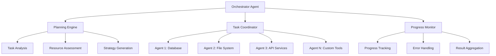

# Agent System

MCPOmni Connect features a sophisticated AI agent system that goes beyond simple tool calling. It provides multiple operation modes designed for different levels of autonomy and complexity.

## Overview

The agent system consists of three main operation modes:

| Mode | Description | Use Case | User Involvement |
|------|-------------|----------|------------------|
| **Chat** | Interactive with approval | Learning, careful operations | High |
| **Autonomous** | Independent execution | Well-defined tasks | Low |
| **Orchestrator** | Multi-agent coordination | Complex workflows | Minimal |

## Chat Mode (Interactive)

**Default mode** - Human-in-the-loop with explicit approval for each action.

### Characteristics

- ✅ **User Control**: Every tool execution requires approval
- ✅ **Educational**: Shows reasoning process step-by-step
- ✅ **Safe**: No unexpected actions
- ✅ **Transparent**: Clear explanation of what each tool does

### Example Interaction

```bash
> Can you analyze the log files and create a summary?

I'll help you analyze the log files. Let me start by finding all log files in the current directory.

🔧 Tool: list_directory
📁 Path: .
📋 Purpose: Find log files to analyze
❓ Execute this tool? (y/n): y

Found 3 log files:
- error.log (2.3 MB)
- access.log (15.7 MB) 
- debug.log (892 KB)

Now I'll read each log file to analyze the contents.

🔧 Tool: read_file
📁 File: error.log
📋 Purpose: Analyze error patterns
❓ Execute this tool? (y/n): y

[Analysis continues with user approval for each step]
```

### When to Use Chat Mode

- Learning how MCPOmni Connect works
- Sensitive operations requiring oversight
- Exploratory data analysis
- Testing new server configurations
- When you want to understand the AI's reasoning

## Autonomous Mode (ReAct Agent)

**Independent execution** - The AI agent operates autonomously using ReAct (Reasoning + Acting) methodology.

### Characteristics

- 🤖 **Independent**: No approval required for tool execution
- 🧠 **Reasoning**: Shows thought process before each action
- 🔄 **Iterative**: Adapts based on results
- 📊 **Goal-Oriented**: Focuses on completing the requested task
- ⚡ **Efficient**: Faster execution without approval delays

### ReAct Methodology

The ReAct framework follows this cycle:

1. **Thought**: Analyze the current situation
2. **Action**: Choose and execute the best tool
3. **Observation**: Process the results
4. **Repeat**: Continue until task completion

### Example Session

```bash
> /mode:auto
Now operating in AUTONOMOUS mode. I will execute tasks independently.

> Create a backup of all configuration files and analyze their contents

🤖 Executing autonomous task: Create backup and analyze configuration files

💭 Thought: I need to find all configuration files first, then create a backup, and finally analyze their contents.

🔧 Action: list_directory(path=".", pattern="*.{json,yaml,yml,conf,config}")
📊 Observation: Found 5 configuration files:
- servers_config.json
- .env
- docker-compose.yaml
- pytest.ini
- pyproject.toml

💭 Thought: Now I'll create a backup directory and copy these files.

🔧 Action: create_directory(path="backup_2024-01-15")
📊 Observation: Backup directory created successfully.

🔧 Action: copy_files(source=["servers_config.json", "docker-compose.yaml", "pytest.ini", "pyproject.toml"], destination="backup_2024-01-15/")
📊 Observation: 4 files copied successfully (excluding .env for security).

💭 Thought: Now I'll analyze each configuration file to understand the project setup.

[Analysis continues autonomously...]

✅ Task Complete: 
- Created backup in backup_2024-01-15/
- Analyzed 4 configuration files
- Generated summary report with key findings
```

### When to Use Autonomous Mode

- Well-defined, routine tasks
- Data processing workflows
- System maintenance operations
- Report generation
- Bulk file operations
- When you trust the AI to work independently

## Orchestrator Mode (Advanced)

**Multi-agent coordination** - Strategic planning and execution across multiple MCP servers and agents.

### Characteristics

- 🎯 **Strategic Planning**: Breaks complex tasks into subtasks
- 🤝 **Multi-Agent**: Coordinates multiple specialized agents
- ⚡ **Parallel Execution**: Runs tasks simultaneously when possible
- 📈 **Scalable**: Handles enterprise-level workflows
- 🔄 **Adaptive**: Adjusts strategy based on real-time results

### Architecture



### Example Workflow

```bash
> /mode:orchestrator
Now operating in ORCHESTRATOR mode. I will coordinate complex multi-step tasks.

> Migrate user data from the old database to the new system, update all configuration files, and send notifications to stakeholders

🎯 Orchestrator: Planning complex migration task

📋 Strategic Plan:
Phase 1: Data Assessment (Parallel)
├─ Agent A: Analyze old database schema
├─ Agent B: Verify new database connectivity  
└─ Agent C: Validate user data integrity

Phase 2: Configuration Preparation (Sequential)
├─ Agent D: Backup current configurations
├─ Agent E: Generate new configuration templates
└─ Agent F: Validate configuration compatibility

Phase 3: Migration Execution (Parallel where safe)
├─ Agent A: Migrate user data (critical path)
├─ Agent G: Update configuration files
└─ Agent H: Prepare notification templates

Phase 4: Validation & Notification (Sequential)
├─ Agent I: Verify migration completeness
├─ Agent J: Test system functionality
└─ Agent K: Send stakeholder notifications

🚀 Executing Phase 1: Data Assessment...

🤖 Agent A (Database): Connecting to legacy database...
🤖 Agent B (Database): Testing new database connection...
🤖 Agent C (Validation): Running data integrity checks...

[Parallel execution continues...]

Phase 1 Complete ✅ (2.3 minutes)
- Legacy schema analyzed: 15 tables, 1.2M records
- New database connection verified
- Data integrity: 99.98% clean (3 minor issues flagged)

🚀 Executing Phase 2: Configuration Preparation...

[Sequential execution continues...]

✅ Migration Complete (12.7 minutes total):
- 1,247,892 user records migrated successfully
- 8 configuration files updated
- 23 stakeholders notified
- Zero data loss, minimal downtime
```

### When to Use Orchestrator Mode

- Complex multi-system operations
- Data migration projects
- Deployment workflows
- Business process automation
- Enterprise integration tasks
- When you need sophisticated coordination

## Mode Switching

You can switch between modes at any time:

```bash
# Switch to autonomous mode
/mode:auto

# Switch to orchestrator mode  
/mode:orchestrator

# Return to interactive chat mode
/mode:chat

# Check current mode
/status
```

## Agent Configuration

Control agent behavior through `AgentConfig` in your `servers_config.json`:

```json
{
    "AgentConfig": {
        "tool_call_timeout": 30,        // Tool execution timeout (seconds)
        "max_steps": 15,                // Maximum steps per task
        "request_limit": 1000,          // Maximum API requests
        "total_tokens_limit": 100000    // Maximum token usage
    }
}
```

### Configuration Options

| Setting | Description | Chat Mode | Auto Mode | Orchestrator |
|---------|-------------|-----------|-----------|--------------|
| `tool_call_timeout` | Tool execution timeout | ✅ | ✅ | ✅ |
| `max_steps` | Maximum reasoning steps | ❌ | ✅ | ✅ |
| `request_limit` | API call limit | ✅ | ✅ | ✅ |
| `total_tokens_limit` | Token usage limit | ✅ | ✅ | ✅ |

## Safety and Control

### Built-in Safeguards

- **Timeout Protection**: Prevents infinite loops
- **Resource Limits**: Controls API usage and costs
- **Step Limits**: Prevents excessive reasoning cycles
- **Error Recovery**: Graceful handling of failures
- **User Override**: Emergency stop with Ctrl+C

### Best Practices

!!! tip "Safe Agent Usage"
    1. **Start with Chat Mode** when learning
    2. **Test in Autonomous Mode** with simple tasks first
    3. **Use Orchestrator Mode** for complex, well-understood workflows
    4. **Set Conservative Limits** for production environments
    5. **Monitor Resource Usage** with `/api_stats`

### Security Considerations

- **No Arbitrary Code Execution**: Agents only use predefined tools
- **Server Isolation**: Tools are isolated to their respective servers
- **Audit Trail**: All actions are logged for review
- **Permission Model**: Agents respect server-level permissions

## Advanced Features

### Context Management

- **Long-term Memory**: Persistent context across sessions
- **Task Context**: Maintains context within multi-step tasks
- **Cross-Agent Communication**: Agents can share relevant information

### Error Handling

- **Graceful Degradation**: Continues with available tools if some fail
- **Retry Logic**: Automatic retry for transient failures
- **Fallback Strategies**: Alternative approaches when primary methods fail

### Performance Optimization

- **Parallel Execution**: Runs independent tasks simultaneously
- **Tool Caching**: Caches frequently used tool results
- **Smart Batching**: Groups related operations for efficiency

---

**Next**: [Tool Orchestration →](tool-orchestration.md) 