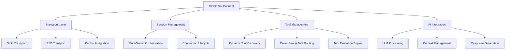

# 🚀 MCPOmni Connect - Universal Gateway to MCP Servers

!!! tip "New to MCPOmni Connect?"
    Start with the [Installation Guide](getting-started/installation.md) and [Quick Start](getting-started/quick-start.md) to get up and running in minutes.

MCPOmni Connect is a powerful, intelligent AI agent system and universal command-line interface (CLI) that goes beyond being just a gateway to the Model Context Protocol (MCP) ecosystem. It acts as an autonomous agent through its **ReAct Agent Mode** and **Orchestrator Mode**, capable of independent reasoning, decision-making, and complex task execution.

## ✨ Key Features

### 🤖 Intelligent Agent System

=== "ReAct Agent Mode"
    - Autonomous task execution with reasoning and action cycles
    - Independent decision-making without human intervention
    - Advanced problem-solving through iterative reasoning
    - Self-guided tool selection and execution
    - Complex task decomposition and handling

=== "Orchestrator Agent Mode"
    - Strategic multi-step task planning and execution
    - Intelligent coordination across multiple MCP servers
    - Dynamic agent delegation and communication
    - Parallel task execution when possible
    - Sophisticated workflow management with real-time progress monitoring

=== "Interactive Chat Mode"
    - Human-in-the-loop task execution with approval workflows
    - Step-by-step guidance and explanations
    - Educational mode for understanding AI decision processes

### 🔌 Universal Connectivity

- **Multi-Protocol Support**: stdio, Server-Sent Events (SSE), Streamable HTTP
- **Authentication Support**: OAuth 2.0, Bearer tokens, custom headers
- **Container Integration**: Docker and NPX package execution
- **Extensible Transport Layer**: Future-ready protocol support

### 🧠 AI-Powered Intelligence

MCPOmni Connect uses **LiteLLM** for unified access to 100+ AI models across all major providers:

- **OpenAI** (GPT-4, GPT-3.5, etc.)
- **Anthropic** (Claude 3.5 Sonnet, Claude 3 Haiku, etc.)
- **Google** (Gemini Pro, Gemini Flash, etc.)
- **Groq** (Llama, Mixtral, Gemma, etc.)
- **DeepSeek** (DeepSeek-V3, DeepSeek-Coder, etc.)
- **Azure OpenAI**, **OpenRouter**, **Ollama** (local models)

### 🔒 Security & Privacy

- **Explicit User Control**: All tool executions require user approval in chat mode
- **Data Protection**: Strict access controls and server-specific isolation
- **Privacy-First**: Minimal data collection, encrypted transport protocols

### 💾 Memory Management

- **Redis-Powered Persistence**: Long-term conversation memory storage
- **File-Based Chat History**: Save and restore complete conversations
- **Intelligent Context Management**: Automatic context pruning and retrieval

## 🏗️ Architecture

## 🚀 Quick Start

!!! example "Get Started in 3 Steps"
    1. **Install**: `uv add mcpomni-connect` or `pip install mcpomni-connect`
    2. **Configure**: Set up your `.env` file and `servers_config.json`
    3. **Run**: Execute `mcpomni_connect` to start the CLI

    [Detailed Installation Guide →](getting-started/installation.md){ .md-button .md-button--primary }

## 📖 Documentation Structure

-   **🚀 Getting Started**

    ---
    
    Installation, quick start, and basic setup instructions
    
    [:octicons-arrow-right-24: Get Started](getting-started/installation.md)

-   **⚙️ Configuration**

    ---
    
    Complete configuration guide including transport types and authentication
    
    [:octicons-arrow-right-24: Configure](configuration/configuration-guide.md)

-   **📚 User Guide**

    ---
    
    Detailed usage instructions, commands, and operation modes
    
    [:octicons-arrow-right-24: Learn](user-guide/basic-usage.md)

-   **🎯 Features**

    ---
    
    Deep dive into agent systems, tool orchestration, and advanced features
    
    [:octicons-arrow-right-24: Explore](features/agent-system.md)

-   **🔧 Advanced**

    ---
    
    Architecture details, API reference, and advanced examples
    
    [:octicons-arrow-right-24: Advanced](advanced/architecture.md)

-   **👨‍💻 Development**

    ---
    
    Testing, contributing, and development guidelines
    
    [:octicons-arrow-right-24: Contribute](development/contributing.md)

## 🎯 Use Cases

MCPOmni Connect excels in scenarios requiring:

- **Multi-System Integration**: Connect and orchestrate across different MCP servers
- **Autonomous Task Execution**: Let AI agents handle complex workflows independently
- **Interactive Development**: Build and test MCP integrations with immediate feedback
- **Enterprise Automation**: Scale AI-powered automation across organizational tools

## 📬 Support & Community

- **Documentation**: You're reading it! 📖
- **Issues**: [GitHub Issues](https://github.com/Abiorh001/mcp_omni_connect/issues)
- **Discussions**: [GitHub Discussions](https://github.com/Abiorh001/mcp_omni_connect/discussions)
- **Email**: abiolaadedayo1993@gmail.com

---

*Ready to connect your AI to everything? Let's get started!* 🚀 